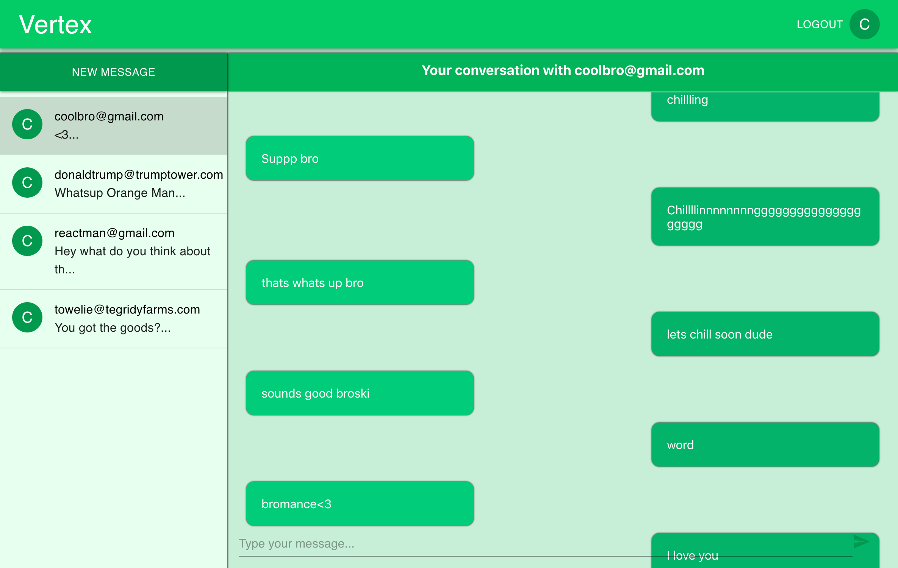

<h2>Getting Started</h2> 
(this project uses react and firebase) 

•	Clone this repo  
•	npm install to install all req'd dependencies  
•	Go to firebase and create a new project. Copy the new project’s API key and replace it with the API key under ./src/index.js/  
•	Inside your firebase project database, create 2 new collections called 'chats' and 'users'  
•	Inside you new app folder, npm start to start the local server 

You can checkout the live preview of this project here -> https://chatapp-36ea4.web.app/login/

